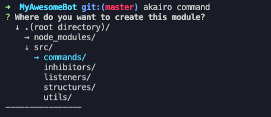
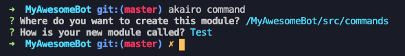

# akairo-cli

A Node.js CLI to generate templates for the [discord-akairo](https://npmjs.com/package/discord-akairo) framework.


## Table of Contents
- [Usage](#usage)
- [Screenshots](#screenshots)
- [TO-DO](#to-do)
- [License](#license)


## Usage

You can install the CLI by running the following command in your terminal:
```
$ npm install -g akairo-cli
```

You can now use the CLI! Use it like this:
```
$ akairo <template>
```
`<template>` has to be one of:
- `command` to create an [Akairo Command](https://discord-akairo.github.io/#/docs/main/master/class/Command) ;
- `listener` to create an [Akairo Listener](https://discord-akairo.github.io/#/docs/main/master/class/Listener) ;
- `inhibitor` to create an [Akairo Inhibitor](https://discord-akairo.github.io/#/docs/main/master/class/Inhibitor) ;

If your bot is written in TypeScript, then you can also add the `--ts` flag to create a `.ts` file with types.


## Screenshots

Screenshot of the file selector, to choose the path:



Screenshot of the all the prompts to create a command:




## TO-DO

- [ ] Support custom modules


## License

Copyright © 2020 Elliot 'noftaly' Maisl. Licensed under the MIT license, see [the license](./LICENSE).
